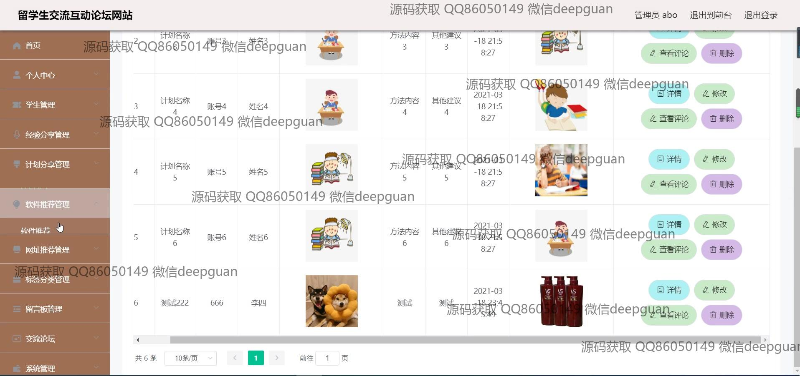
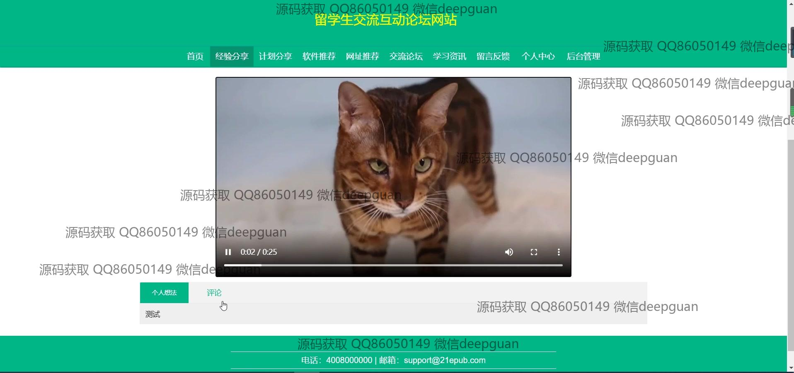

<h1 align="center">的留学生交流互动论坛网站vue</h1>

## 简介
A留学生交流互动论坛系统：角色分为管理员、用户；功能包括经验分享、计划管理、文件上传、网址推荐、留言管理、多媒体互动与评论功能。    --计算机毕业设计源码；毕设源码；java毕业设计源码

## 联系方式

<h3 align="center">获取完整代码与数据库文件 + 微信：deepguan QQ: 86050149 QQ群: 783742310</h3>

<h3 align="center">可帮忙远程部署 包运行成功！提供远程部署、修改代码、设计文档指导、代码讲解等服务！</h3>

## 功能介绍（完整见运行截图）
管理员：基本功能包括管理会员、经验分享、计划分享、文件上传等。网站功能模块涵盖留言管理、网址推荐管理、学生活动管理、经验和计划分享管理等。管理员可执行的数据操作包括查看、修改、删除、回复，以及通过多种搜索和过滤工具进行高效管理。导航栏提供便捷的模块间切换，支持后台管理和用户反馈处理。

用户：基本功能包括注册、登录、注销、信息修改。用户可在不同功能板块自由浏览和参与，如经验分享、计划讨论、软件和网址推荐、视频分享、互动论坛等。支持多种方式的内容编辑、媒体上传与分享。用户中心提供个人信息管理、头像上传，以及分享和交流历史记录查看。访问权限包括评论、点赞、搜索，以及对分享内容的浏览与互动。

## 运行截图

本代码来源于网络,仅供学习参考使用!

